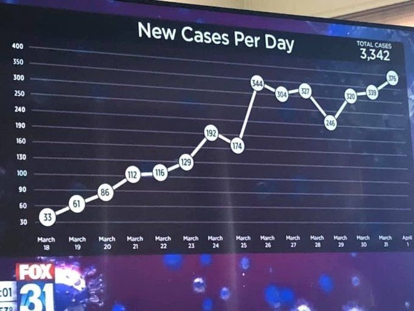
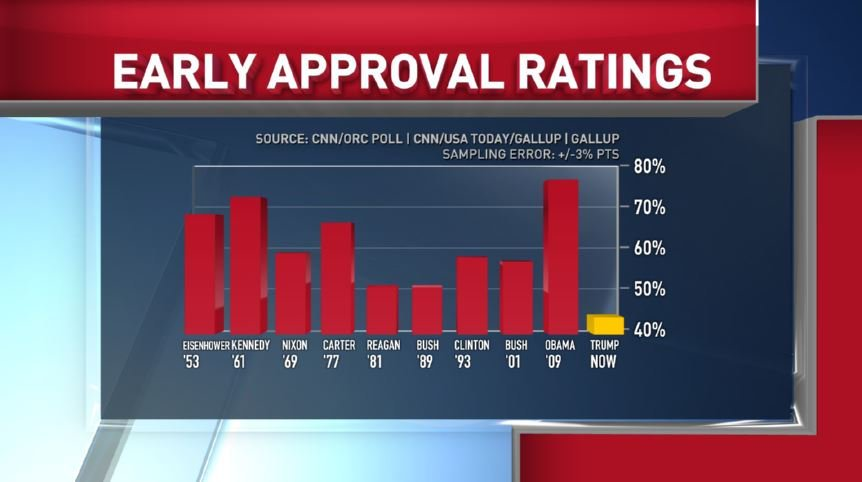
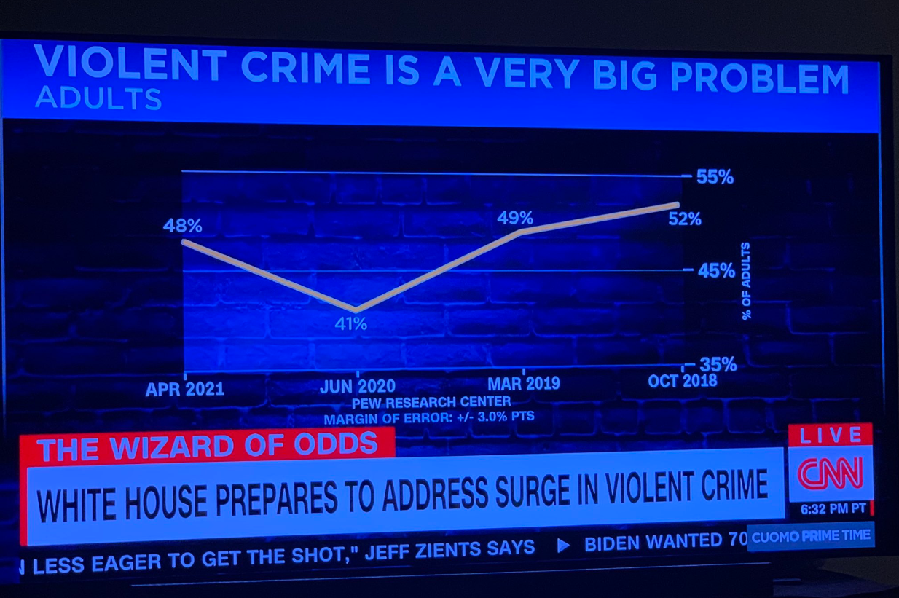
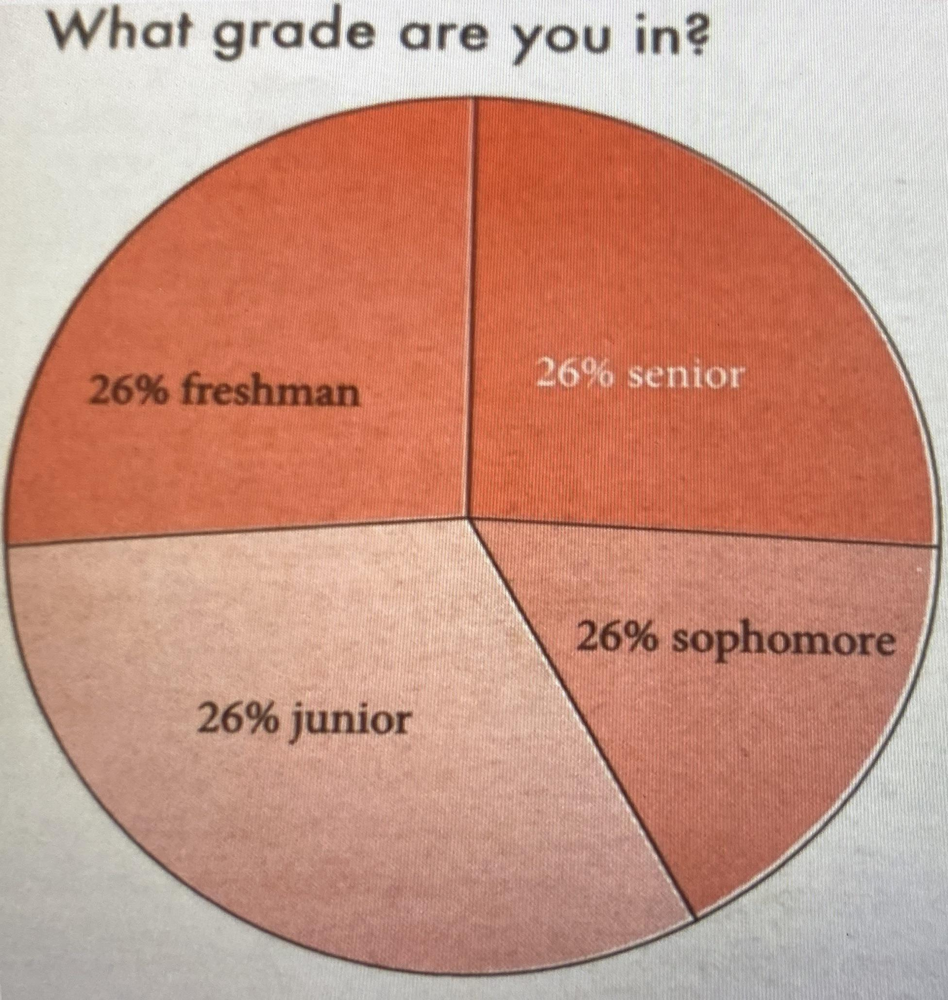
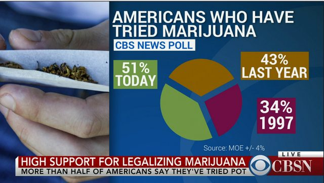
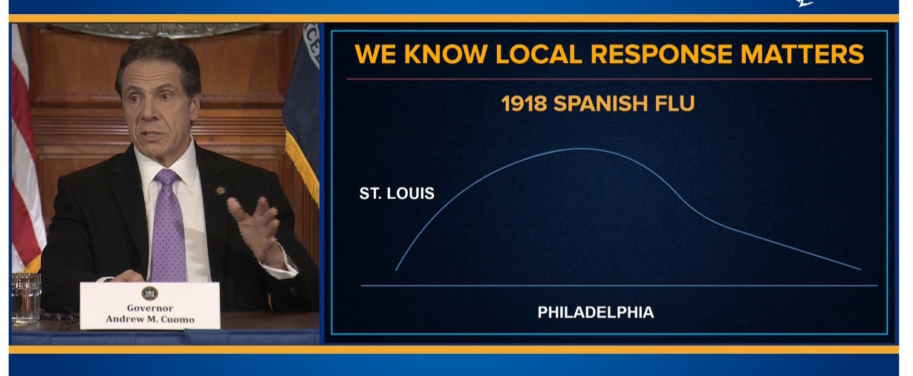

Here's a collection of bad graphs.

Some are bad because the scaling is off
----

 

 

 

Others are bad because tricks are played with the y-axis
------

 

 

Or with the x-axis
-------

 

Pie Charts are especially susceptible to being awful
----------

 

 

 

And some are just pure nonsense
---

